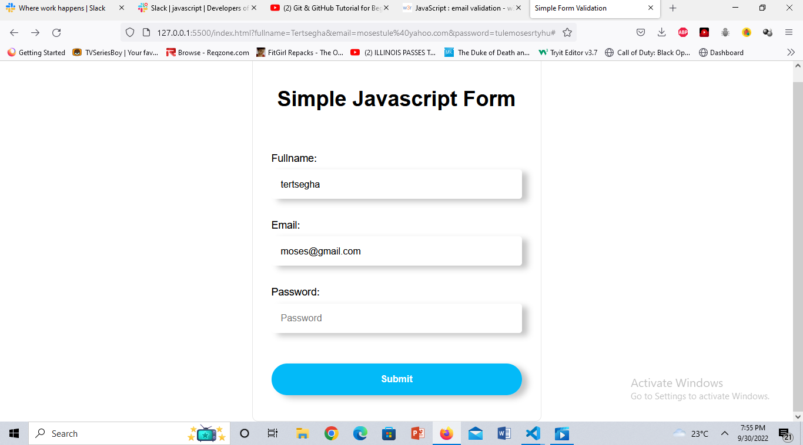

## Overview

### The challenge

Users should be able to:

- View the optimal layout for the section depending on their device's screen size
-Validate User information.
### Screenshot

## My process

### Built with

- Semantic HTML5 markup
- CSS custom properties
- Flexbox
- Mobile-first workflow

### What I learned

I was able to learn how to place containers dynamically with grid, to create a seemless layout.

### Continued development

Continued learning on how to position divs with Position absolute.

### Useful resources

- https://www.stackoverflow.com - This helped me to understand fully how to validate user-end forms.

## Author
- Twitter - [@mosestule](https://www.twitter.com/yourusername)

## Live URL
 https://mosestule2003.github.io/Form-Validation/
 
